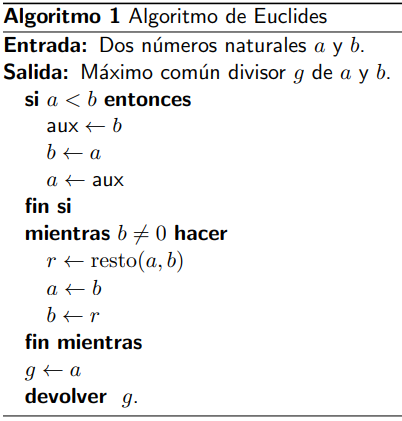

# CLASE 2 - 31/07/2025

## Divisibilidad

### Definición 1.1.4

Sean $a,b\in\mathbb{Z}$. Decimos que $a$ divide a $b$ ($b$ es múltiplo de $a$) sii $\exists c\in\mathbb{Z}:b=ac$.

Utilizamos las siguientes notaciones en orden de frecuencia:

- $a|b$
- $b=\dot{a}$
- $resto(b,a)=0$
- $b\equiv0(mod(a))$

#### Ejemplos

- $3|9$ o $9=\dot{3}$
- $-5|15$ o $15=\dot{-5}$
- $-7|28$ o $28=\dot{-7}$
- $11|0$ o $0=\dot{11}$ (cualquier número divide a $0$)

**Observación**: $a|b\leftrightarrow|a|\mid|b|$

### Propiedades 1.1.5

Sean $a,b,c\in\mathbb{Z}^+$. Entonces:

1. Si $a|b,b|a$, entonces $a=b$
2. Si $a|b,b|c$, entonces $a|c$
3. $a|b\leftrightarrow ac|bc$
4. Si $a|b,a|c$, entonces $a|\alpha b+\beta c\quad\forall\alpha,\beta\in\mathbb{Z}$
5. Si $a|b,a|c$, entonces $a|resto(b,c)$

## Máximo común divisor

### Definición 1.2.1 (notación)

Si $a\in\mathbb{Z}$, denotamos diferentes conjuntos de divisores de la siguiente manera:

- $Div(a)=\{d\in\mathbb{Z}:d|a\}$
- $Div_+(a)=\{d\in\mathbb{Z}^+:d|a\}$

Por ejemplo:

- $Div(12)=\{\pm1,\pm2,\pm3,\pm4,\pm6,\pm12\}$
- $Div_+(12)=\{1,2,3,4,6,12\}$

### Definición 1.2.2 (número primo)

Decimos que un entero positivo $p\in\mathbb{Z}^+$ es primo sii:

- $\#Div(p)=2$

### Definición 1.2.4 (máximo común divisor)

Sean $a,b\in\mathbb{Z}$, definimos el máximo común divisor de $a,b$, que escribiremos $mcd(a,b)$ (o simplemente $(a,b)$) de la siguiente manera:

- Si $a\neq0$ o $b\neq0$, definimos:
    - $mcd(a,b)=max\{Div(a)\cap Div(b)\}=max\{x\in\mathbb{Z}:x\mid a\text{ y }x\mid b\}$
- En caso contrario definimos $mcd(0,0)=0$

#### Propiedades 1.2.5

1. $mcd(1,a)=1$ para todo $a\in\mathbb{Z}$
2. $mcd(0,b)=|b|$ para todo $b\in\mathbb{Z}$
3. $mcd(a,b)=mcd(|a|,|b|)$ para todo $a,b\in\mathbb{Z}$

#### Observaciones

1. Cuando $mcd(a,b)=1$, decimos que $a$ y $b$ son coprimos o primos entre sí.
2. Podemos hallar el máximo común divisor entre dos números usando la definición, pero esto implicaría buscar todos los divisores de cada uno de los números y encontrar el máximo entre ellos. Esto es claramente muy ineficiente, especialmente para números más grandes.
    A raíz de esto, va a ser de nuestro interés encontrar un método que nos ayude a mejorar el proceso de calcular un máximo común divisor.
    La siguiente propiedad, si bien es sencilla de probar, es clave para desarrollar dicho método.

### Proposición 1.2.6

Dados $a,b\in\mathbb{Z}$ con $a,b\neq0$, entonces:

1. $mcd(a,b)=mcd(b,a-bx)$ para todo $x\in\mathbb{Z}$
2. En particular, si $r$ es el resto de dividir $a$ entre $b$, se tiene que $mcd(a,b)=mcd(b,r)$ pues $r=a-bq$

#### Demostración

Considerando la propiedad 3 de la sección 1.2.5, bastará con probar esto para $a$ y $b$ positivos.

Llamemos $d=mcd(a,b)$ y $d'=mcd(b,a-bx)$. La estrategia de la demostración será demostrar que $d\leq d'$ y $d'\leq d$.

- $d\leq d'$

    $$
    \begin{aligned}
    &\begin{cases}d\mid a\\d\mid b\end{cases}\\
    &\Rightarrow\scriptstyle{(\text{por propiedades de divisibilidad (1.1.5)})}\\
    &\begin{cases}d\mid a-bx\\d\mid b\end{cases}\\
    \end{aligned}
    $$
    Entonces tenemos que $d\in Div(a-bx)\cup Div(b)$, por lo tanto $d\leq mcd(b,a-bx)=d'$.

- $d'\leq d$

    $$
    \begin{aligned}
    &\begin{cases}d\mid b\\d\mid a-bx\end{cases}\\
    &\Rightarrow\scriptstyle{(\text{por propiedades de divisibilidad (1.1.5)})}\\
    &\begin{cases}d\mid 1(a-bx)+x(b)\\d\mid b\end{cases}\\
    &\Rightarrow\scriptstyle{(\text{operatoria})}\\
    &\begin{cases}d\mid a\\d\mid b\end{cases}\\
    \end{aligned}
    $$
    Entonces tenemos que $d'\in Div(a)\cup Div(b)$, por lo tanto $d'\leq mcd(a,b)=d$

Reagrupando las dos partes, concluimos que:

- $mcd(a,b)=mcd(b,a-bx)$

#### Ejemplo 1.2.7 (algoritmo de Bezout)

Para esta parte, utilizaremos el algoritmo de Bezout, que básicamente utiliza la proposición 1.2.6 que probamos anteriormente. Veamos un ejemplo calculando $mcd(96,60)$:

$$
\begin{aligned}
&mcd(96,60)\\
&=\\
&mcd(60,36)\\
&=\\
&mcd(36,24)\\
&=\\
&mcd(24,12)\\
&=\\
&mcd(12,0)\\
&=\\
&12
\end{aligned}
$$

Este es un ejemplo básico de como aplicar el algoritmo de Bezout, la idea es muy simple, ir calculando los restos hasta que hallamos un resto 0, en ese punto hallamos el resultado.
Veamos la implementación de este algoritmo usando pseudocódigo:

### Teorema 1.2.8 (Igualdad de Bezout)

Sean $a,b\in\mathbb{Z}$, con $a,b\neq0$, entonces:

1. $mcd(a,b)=min\{s>0:s=ax+by,\text{ para algún }x,y\in\mathbb{Z}\}$.
2. En particular, existen $x,y\in\mathbb{Z}$ tal que $mcd(a,b)=ax+by$

Algunas aclaraciones antes de demostrar el teorema:

- El enunciado del teorema, nos dice que de todas las combinaciones lineales de $a$ y $b$ con coeficientes enteros que dan un resultado positivo, el $mcd(a,b)$ es la menor.
- La segunda parte del teorema, es lo que se conoce como la **Igualdad de Bezout** y los enteros $x,y$ se llaman los **coeficientes de Bezout**.

Ahora si, veamos la demostración del teorema.

#### Demostración

Llamemos $S=\{s>0:s=ax+by,\text{ para algún }x,y\in\mathbb{Z}\}$. Por definición, tenemos que:

- $S\subset \mathbb{Z}^+$ y que además,
- $S\neq\emptyset$
    - Esto porque considerando $x=a$ y $b=y$, tenemos que $s=a^2+b^2>0$ pertenece a $S$.

Por lo tanto, por el principio del buen orden, $S$ tiene mínimo y lo llamamos $s_0=min(S)$. Queremos probar que $s_0=mcd(a,b)$, para esto usaremos la misma estrategia que en la última demostración, o sea, considerando $d=mcd(a,b)$ vamos a probar que $d\leq s_0$ y $s_0\leq d$.
Sean $x_0,y_0\in\mathbb{Z}$ tales que $s_0=ax_0+by_0$.
- $d\leq s_0$

    $$
    \begin{aligned}
    &\begin{cases}d\mid a\\d\mid b\end{cases}\\
    &\Rightarrow\scriptstyle{(\text{por propiedades de divisibilidad (1.1.5)})}\\
    &d\mid ax_0+by_0=s_0
    \end{aligned}
    $$
    Entonces $d\leq s_0$.
- $s_0\leq d$

    Por el teorema de la división entera, tenemos que existen $q,r\in\mathbb{Z}$ tales que:
    - $a=qs_0+r$ y $0\leq r < s_0$, luego:
    
        $$
        \begin{aligned}
        &r=a-qs_0\\
        &\iff\\
        &r=a-q(ax_0+by_0)\\
        &\iff\\
        &r=a(1-qx_0)+b(-qy_0)
        \end{aligned}
        $$

    Por lo tanto, si $r$ fuera positivo, tendríamos que $r\in S$; pero como $s_0$ es el mínimo de dicho conjunto y $r<S$, necesariamente $r=0$.
    Como $a=qs_0$, entonces $s_0\mid a$.
    El razonamiento para $b$ es análogo, por lo que se concluye que $s_0\in Div(a)\cup Div(b)$, entonces $s_0\leq d$.

Reagrupando las dos partes, concluimos que:

- $ax_0+by_0=mcd(a,b)$

#### Corolario 1.2.9

1. Si $d\mid a, d\mid b$, entonces $d\mid mcd(a,b)$
    - **Demostración**: Por el teorema de Bezout: $mcd(a,b)=ax+by$, entonces:
        - Como $d\mid a$ y $d\mid b$, por propiedades de divisibilidad tenemos que $d \mid ax+by=mcd(a,b)$